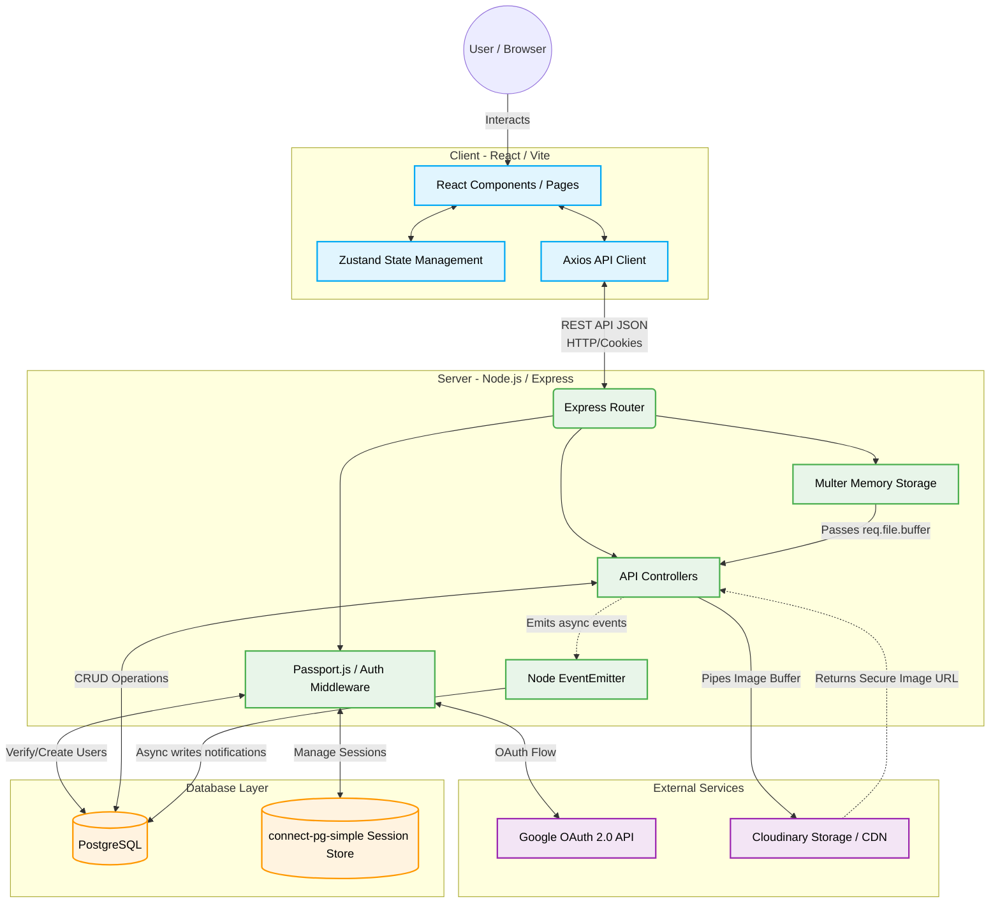

# UOK Connect

🔗 **[Live Demo / Deployed App](https://student-project-portal-mu6m.vercel.app/)**

> An academic project serving as a student portfolio showcase portal for the University of Kelaniya.

**UOK Connect** bridges the gap between students and the industry. It allows students to publish their academic and personal projects, while recruiters can easily discover emerging tech talent. 

## 🚀 Tech Stack

- **Frontend**: React 18, Vite, Tailwind CSS v4, Zustand (State Management)
  - *Libraries:* React Hook Form + Zod (Form Validation), Framer Motion (Animations), Axios, React Router v7
- **Backend**: Node.js, Express 5, Passport.js (Google OAuth 2.0)
  - *Libraries:* Helmet & express-rate-limit (Security), express-validator, JWT & bcryptjs (Auth), cookie-parser
- **Database**: PostgreSQL (hosted on Neon), `connect-pg-simple` (Session Store)
- **File Storage**: Cloudinary (Image CDN), Multer (In-memory uploads)
- **Deployment**: Vercel (Frontend & Backend)

## ✨ Key Features & Engineering Decisions

- **Role-Based Access Control**: Tailored workflows and UI/UX for Students, Recruiters, and Admins.
- **Secure Authentication**: Implemented Single Sign-On (SSO) using Google OAuth 2.0 with session tokens stored in secure, `HTTP-only` cookies to prevent XSS attacks.
- **Optimized Image Processing**: Utilized Multer for in-memory uploads, streaming buffers directly to Cloudinary without writing to the local disk, improving performance and deployment compatibility.
- **Asynchronous Event Architecture**: Decoupled core request logic from side-effects (like generating notifications) using Node's native `EventEmitter`, ensuring fast API response times.

## 🏗 System Architecture



## 💻 Local Setup

### 1. Environment Configuration
Create `.env` files in both the `client/` and `server/` directories using the provided templates.
- **Server (`server/.env`)**: Requires your Neon PostgreSQL URL, Google OAuth credentials, and Cloudinary API keys.
- **Client (`client/.env`)**: Set `VITE_API_URL=http://localhost:5001`.

### 2. Start the Application

**Run the Backend (Port 5001):**
```bash
cd server
npm install
npm run db:setup  # Initializes the Neon PostgreSQL tables
npm run dev
```

**Run the Frontend (Port 5173):**
```bash
cd client
npm install
npm run dev
```