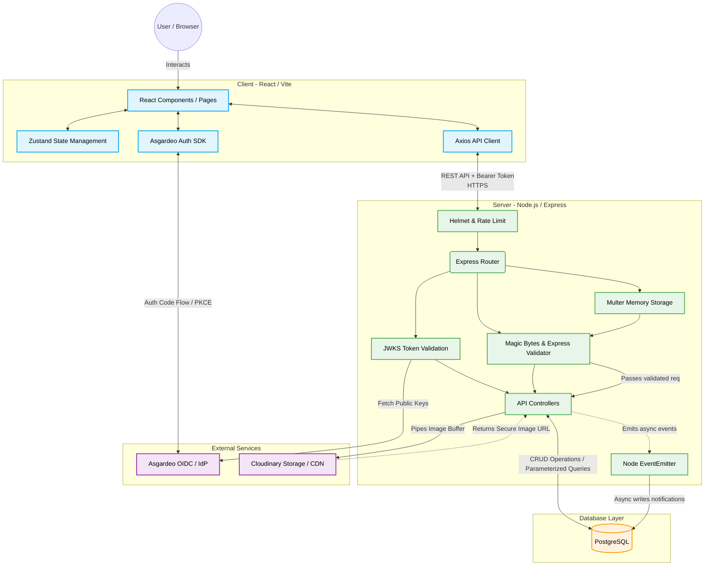

# UOK Connect

🔗 **[Live Demo / Deployed App](https://student-project-portal-mu6m.vercel.app/)**

> An academic project serving as a student portfolio showcase portal for the University of Kelaniya, enhanced with strict information security measures.

**UOK Connect** bridges the gap between students and the industry. It allows students to publish their academic and personal projects, while recruiters can easily discover emerging tech talent. 

## 🚀 Tech Stack & Security

- **Frontend**: React 18, Vite, Tailwind CSS v4, Zustand (State Management)
  - *Auth:* `@asgardeo/auth-react` (OIDC)
  - *Libraries:* React Hook Form + Zod (Form Validation), Framer Motion, Axios, React Router v7
- **Backend**: Node.js, Express 5
  - *Auth:* `express-jwt` + `jwks-rsa` (JWKS-based token validation)
  - *Security:* Helmet (CSP headers), `express-rate-limit`, parameterized queries (SQLi prevention)
- **Database**: PostgreSQL (hosted on Neon)
- **File Storage**: Cloudinary (Image CDN), Multer (In-memory uploads)
- **Deployment**: Vercel (Frontend & Backend)

## 🔐 Security & Access Control (Information Security Assessment)

This application has been hardened to mitigate the **OWASP Top 10** vulnerabilities:

- **Authentication (OIDC):** Uses **Asgardeo** as the cloud Identity Provider (IdP). Authentication relies entirely on IdP-issued access tokens.
- **Zero Self-Minted Tokens:** The backend validates tokens using Asgardeo's JWKS endpoint (asymmetric RS256 cryptography). No `JWT_SECRET` exists in the codebase.
- **Role & Ownership Access Control:** A strict `requireRole` middleware is used alongside ownership validation (`user_id === req.user.id`) to prevent horizontal and vertical privilege escalation.
- **CSRF Resistance:** Uses `Authorization: Bearer <token>` headers instead of cookies.
- **Secure Configuration:** 
  - All secrets are managed via `.env` (excluded from git). 
  - Local development enforces **HTTPS** via locally-trusted certificates (`mkcert`).
  - Strict **Content Security Policy (CSP)** headers are enforced via Helmet.

## 🏗 System Architecture



## 💻 Local Setup (HTTPS Required)

To meet security requirements, the local development server runs over HTTPS.

### 1. Generate SSL Certificates
Install `mkcert` and generate local certificates in the root directory:
```bash
# MacOS (Homebrew)
brew install mkcert
mkcert -install

# Generate certs inside a certs/ folder
mkdir certs && cd certs
mkcert localhost 127.0.0.1 ::1
cd ..
```

### 2. Environment Configuration
Create `.env` files in both the `client/` and `server/` directories using the provided templates (`.env.example`).
**Note:** Ensure you do not commit real credentials.
- **Server (`server/.env`)**: Requires your PostgreSQL URL, Asgardeo Base URL/Client ID, and Cloudinary keys. Set `CLIENT_URL=https://localhost:5173`.
- **Client (`client/.env`)**: Set `VITE_ASGARDEO_CLIENT_ID` and `VITE_ASGARDEO_BASE_URL`.

### 3. Database Initialization
A database creation script is included to set up all tables automatically.

**Run the Backend (Port 5001):**
```bash
cd server
npm install
npm run db:setup  # Creates tables in your PostgreSQL database
npm run dev
```

**Run the Frontend (Port 5173):**
```bash
cd client
npm install
npm run dev
```