# UOK Connect — Database Schema

## Entity Relationship Diagram

```mermaid
erDiagram

    users {
        SERIAL      id             PK
        VARCHAR255  asgardeo_id    UK  "UNIQUE"
        VARCHAR255  name               "NOT NULL"
        VARCHAR255  email          UK  "NOT NULL"
        VARCHAR500  profile_pic
        VARCHAR20   role               "NOT NULL | CHECK: student|recruiter|admin | DEFAULT: student"
        VARCHAR50   student_id     UK  "UNIQUE"
        BOOLEAN     is_blocked         "NOT NULL | DEFAULT: false"
        TIMESTAMP   created_at         "NOT NULL | DEFAULT: NOW()"
        TIMESTAMP   updated_at         "NOT NULL | DEFAULT: NOW() | auto-updated by trigger"
    }

    projects {
        SERIAL      id            PK
        INTEGER     user_id       FK  "NOT NULL → users.id ON DELETE CASCADE"
        VARCHAR255  title             "NOT NULL"
        TEXT        description       "NOT NULL"
        VARCHAR500  thumbnail_url
        VARCHAR500  github_url
        VARCHAR500  demo_url
        JSONB       tech_stack        "NOT NULL | DEFAULT: []"
        VARCHAR20   status            "NOT NULL | CHECK: draft|published|hidden | DEFAULT: published"
        INTEGER     view_count        "NOT NULL | DEFAULT: 0"
        TIMESTAMP   created_at        "NOT NULL | DEFAULT: NOW()"
        TIMESTAMP   updated_at        "NOT NULL | DEFAULT: NOW() | auto-updated by trigger"
    }

    project_tags {
        SERIAL      id         PK
        INTEGER     project_id FK  "NOT NULL → projects.id ON DELETE CASCADE"
        VARCHAR100  tag            "NOT NULL | UNIQUE(project_id, tag)"
    }

    likes {
        SERIAL      id         PK
        INTEGER     user_id    FK  "NOT NULL → users.id ON DELETE CASCADE"
        INTEGER     project_id FK  "NOT NULL → projects.id ON DELETE CASCADE"
        TIMESTAMP   created_at     "NOT NULL | DEFAULT: NOW()"
    }

    comments {
        SERIAL      id         PK
        INTEGER     project_id FK  "NOT NULL → projects.id ON DELETE CASCADE"
        INTEGER     user_id    FK  "NOT NULL → users.id ON DELETE CASCADE"
        TEXT        content        "NOT NULL"
        BOOLEAN     is_private     "NOT NULL | DEFAULT: FALSE"
        TIMESTAMP   created_at     "NOT NULL | DEFAULT: NOW()"
        TIMESTAMP   updated_at     "NOT NULL | DEFAULT: NOW() | auto-updated by trigger"
    }

    followers {
        SERIAL      id           PK
        INTEGER     follower_id  FK  "NOT NULL → users.id ON DELETE CASCADE"
        INTEGER     following_id FK  "NOT NULL → users.id ON DELETE CASCADE"
        TIMESTAMP   created_at       "NOT NULL | DEFAULT: NOW()"
    }

    notifications {
        SERIAL      id           PK
        INTEGER     recipient_id FK  "NOT NULL → users.id ON DELETE CASCADE"
        INTEGER     actor_id     FK  "nullable → users.id ON DELETE SET NULL"
        INTEGER     project_id   FK  "nullable → projects.id ON DELETE SET NULL"
        VARCHAR50   type             "NOT NULL | CHECK: like|follow|project_created|comment|user_registered|admin_action|admin_edit|admin_delete|admin_hide|admin_removal"
        TEXT        message          "NOT NULL"
        BOOLEAN     is_private       "NOT NULL | DEFAULT: FALSE"
        BOOLEAN     is_read          "NOT NULL | DEFAULT: false"
        TIMESTAMP   read_at          "nullable — set when is_read flips to true"
        TIMESTAMP   created_at       "NOT NULL | DEFAULT: NOW()"
    }

    project_views {
        SERIAL      id         PK
        INTEGER     user_id    FK  "NOT NULL → users.id ON DELETE CASCADE"
        INTEGER     project_id FK  "NOT NULL → projects.id ON DELETE CASCADE"
        TIMESTAMP   created_at     "NOT NULL | DEFAULT: NOW()"
    }

    users          ||--o{ projects       : "owns (user_id)"
    users          ||--o{ likes          : "gives (user_id)"
    users          ||--o{ comments       : "authors (user_id)"
    users          ||--o{ followers      : "follows (follower_id)"
    users          ||--o{ followers      : "is followed by (following_id)"
    users          ||--o{ notifications  : "receives (recipient_id)"
    users          ||--o{ notifications  : "triggers (actor_id)"
    users          ||--o{ project_views  : "views (user_id)"
    projects       ||--o{ project_tags   : "tagged with (project_id)"
    projects       ||--o{ likes          : "receives (project_id)"
    projects       ||--o{ comments       : "has (project_id)"
    projects       ||--o{ notifications  : "referenced in (project_id)"
    projects       ||--o{ project_views  : "viewed (project_id)"
```

---

## Table Notes

### `users`
| Column | Notes |
|--------|-------|
| `role` | `'student'` can add/edit/delete projects · `'recruiter'` can like/follow · `'admin'` has full moderation access |
| `student_id` | Unique identifier for students |
| `is_blocked` | Set to `TRUE` to prevent a user from logging in or taking actions |
| `asgardeo_id` | OAuth subject ID provided by Asgardeo |

### `projects`
| Column | Notes |
|--------|-------|
| `status` | `'published'` is the default; `'draft'` hides the project; `'hidden'` is used by admins to hide inappropriate projects |
| `tech_stack` | JSONB array of strings, e.g. `["React", "Node.js", "PostgreSQL"]` |
| `view_count` | Incremented server-side on each `GET /api/projects/:id` call |

### `project_tags`
Separate table (not inlined in `projects`) to allow efficient tag-based filtering queries.  
`UNIQUE(project_id, tag)` prevents duplicate tags on the same project.

### `likes`
`UNIQUE(user_id, project_id)` enforces one like per user per project at the DB level.  

### `comments`
Stores user comments on projects.
`is_private` boolean to support private comments.

### `project_views`
`UNIQUE(user_id, project_id)` tracks unique views per user per project.

### `followers`
`UNIQUE(follower_id, following_id)` prevents duplicate follows.  
`CHECK(follower_id <> following_id)` prevents self-follow at the DB level.

### `notifications`
Created **only** through the event system (`EventEmitter`), never directly from controllers.  
`actor_id` is nullable to support future system-generated notifications.  
`project_id` is nullable because follow/admin notifications are not always project-specific.  

---

## Indexes

| Index | Table | Columns | Purpose |
|-------|-------|---------|---------|
| `idx_projects_status_created` | `projects` | `(status, created_at DESC)` | `GET /projects` filter + sort |
| `idx_projects_user_id` | `projects` | `(user_id)` | `GET /users/:id/projects` |
| `idx_likes_project_id` | `likes` | `(project_id)` | Like-count subquery aggregate |
| `idx_comments_project_id` | `comments` | `(project_id)` | Fetch comments for a project |
| `idx_comments_user_id` | `comments` | `(user_id)` | Fetch comments by a user |
| `idx_project_tags_project_id` | `project_tags` | `(project_id)` | Tag join in project queries |
| `idx_notifications_recipient_read` | `notifications` | `(recipient_id, is_read)` | Fetch + mark-read queries |
| `idx_followers_following_id` | `followers` | `(following_id)` | Follower-count in user profile |

Unique constraints (`UNIQUE(user_id, project_id)` on `likes`, `UNIQUE(follower_id, following_id)` on `followers`, `UNIQUE(project_id, tag)` on `project_tags`) are automatically backed by unique indexes.

---

## Constraint Summary

| Table | Constraint | Type |
|-------|-----------|------|
| `users` | `role IN ('student','recruiter','admin')` | CHECK |
| `projects` | `status IN ('draft','published','hidden')` | CHECK |
| `notifications` | `type IN ('like', 'follow', 'project_created', 'comment', 'user_registered', 'admin_action', 'admin_edit', 'admin_delete', 'admin_hide', 'admin_removal')` | CHECK |
| `followers` | `follower_id <> following_id` | CHECK |
| `likes` | `(user_id, project_id)` | UNIQUE |
| `project_views` | `(user_id, project_id)` | UNIQUE |
| `followers` | `(follower_id, following_id)` | UNIQUE |
| `project_tags` | `(project_id, tag)` | UNIQUE |
